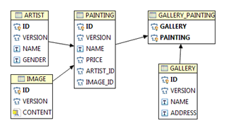
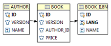

# ezSQL
Simple ORM library for JAVA

(This document is a work in progress)

## Index

* [Introduction](#introduction)
* [SimpleJDBC](#simplejdbc)
* [Environment](#environment)
	* [Entity Relation Diagram](#entity-relation-diagram)
	* [Table ARTIST definition](#table-artist-definition)
	* [Table PAINTING definition](#table-painting-definition)
	* [Table IMAGE definition](#table-image-definition)
	* [Table GALLERY definition](#table-gallery-definition)
* [EXAMPLES](#examples)
	* [Updatable](#updatable)
	* [INSERT EXAMPLES](#insert-examples)
		* [Simple insert](#simple-insert)
		* [Insert LOB example](#insert-lob-example)
		* [Generated Keys](#generated-keys)
		* [Batch Insert](#batch-insert)
		* [PreInsert](#preinsert)
		* [PostInsert](#postinsert)
	* [UPDATE EXAMPLES](#update-examples)
		* [Simple update](#simple-update)
		* [Update LOB example](#update-lob-example)
		* [Batch Update](#batch-update)
		* [PreUpdate](#preupdate)
		* [PostUpdate](#postupdate)
	* [DELETE EXAMPLES](#delete-examples)
		* [Simple delete](#simple-delete)
		* [Batch Delete](#batch-delete)
		* [PreDelete](#predelete)
		* [PostDelete](#postdelete)
	* [QUERY EXAMPLES](#query-examples)
		* [Domain classes](#domain-classes)
		* [Simple Query](#simple-query)
		* [Result Transformer example](#result-transformer-example)
		* [Result Processor example](#result-processor-example)
		* [Bean Results](#bean-results)
		* [Column Subquery](#column-subquery)
		* [Where Subquery](#where-subquery)
		* [Inner join](#inner-join)
		* [Outer join](#outer-join)
		* [Outer Fetch](#outer-fetch)
		* [Inner Fetch](#inner-fetch)
		* [Exists](#exists)
		* [Group By](#group-by)
		* [Order By](#order-by)
		* [Union](#union)
		* [Case Statement](#case-statement)
		* [Pagination](#pagination)
	* [Association Discriminator](#association-discriminator)
	* [Column Discriminator](#column-discriminator)
	* [Custom Functions](#custom-functions)
	* [Table Triggers](#table-triggers)
	* [Stored Procedures](#stored-procedures)

## Introduction

**ezSQL** is a tool that aims to simplify the work of a developer when writing and executing SQL.
It is _just_ a wrapper around JDBC.

It provides an easy way of executing **static typed** SQL and to project results to arbitrary beans.
To handle SQL, without hiding it, is the main goal of this tool. ORM features are just a bonus.

Some quick examples just to open the apetite.

Retrive the query results into a list of beans.

```java
List<Artist> artists = db.query(TArtist.T_ARTIST)
	.all()
	.list(Artist.class);
```

Return the result of a single column.

```java
List<String> artistNames = db.query(TArtist.T_ARTIST)
	.column(TArtist.C_NAME)
	.listRaw(String.class);
```

Update without the use of beans.

```java
db.update(TArtist.T_ARTIST)
    .set(TArtist.C_NAME, "Henri Matisse")
    .where(TArtist.C_ID.is(3L))
    .execute();
```

ezSQL was born out of the frustration of the "magic" of Hibernate.
Also, writing HQL in plain text led to many mistakes and made refactoring dificult.
Another issue was the impossible task of serializing my entity beans
without bringing along the entire database.

_(Side note: the goSQL project is the same as this project, but in Go.)_

Main Features:
* SQL DSL
* Static typed
* CRUD actions using beans
* Simple join declaration
* Populate struct tree with query results containing joins
* Subqueries
* Result transformation
* Result Pagination
* Automatic setting of primary keys for inserts
* Optimistic Locking with automatic version increment
* Simple Object Relationship Mapping
* Pre/Post insert/update/delete bean triggers
* Database abstraction
* Extensible

## SimpleJDBC
ezSQL is build on top of the class named **SimpleJDBC**.
This class isolates the developer from the details of JDBC call, like statement creation,
exception handling, parameters handling, etc
This class does not depend of ezSQL. The developer can use this class if it needs a low level control.


## Environment
To use ezSQL we must need to know the database structure.
It is not a static configuration, and we could use it in a dynamic schema (altered in runtime by adding tables, columns)
with the proper supporting code. The common use is to define the database structure as exemplified in the following sections.

### Entity Relation Diagram
The examples in the next chapter will use the tables that are defined according to the following ER diagram:



Relationships explained:
- **One-to-Many**: One `ARTIST` that can have many `PAINTING`'s and one `PAINTING` has one `ARTIST`.
- **One-to-One**: One `PAINTING` has one `IMAGE` and one `IMAGE` has one `PAINTING`.
- **Many-to-Many**: One `PAINTING` can have many `GALLERY`'s and one `GALLERY` can have many `PAINTING`'s

Despite the previous explanation of relationships, they are declared in the same way.
Think of them as paths to get from one table to another.

### Table ARTIST definition

Definition of a table `ARTIST` and its columns, identifying key fields, version field, etc.

```java
import java.util.Date;

import pt.quintans.ezSQL.db.*;
import pt.quintans.ezSQL.orm.app.domain.EGender;

public class TArtist {
    public static final Table T_ARTIST = new Table("ARTIST");

    public static final Column<Long> C_ID = T_ARTIST
    		.BIGINT("ID").key();
    public static final Column<Integer> C_VERSION = T_ARTIST
    		.INTEGER("VERSION").version();
    public static final Column<String> C_NAME = T_ARTIST
    		.VARCHAR("NAME");
    public static final Column<EGender> C_GENDER = T_ARTIST
    		.NAMED("GENDER");
    public static final Column<Date> C_BIRTHDAY = T_ARTIST
    		.TIMESTAMP("BIRTHDAY");
    public static final Column<Date> C_CREATION = T_ARTIST
    		.TIMESTAMP("CREATION");
    public static final Column<Date> C_MODIFICATION = T_ARTIST
    		.TIMESTAMP("MODIFICATION");

    // audit table triggers
    static {
    	T_ARTIST.setPreInsertTrigger(new PreInsertTrigger() {
			@Override
			public void trigger(Insert ins) {
	            ins.set(C_VERSION, 1);
	            ins.set(C_CREATION, new java.util.Date());
			}
		});

    	T_ARTIST.setPreUpdateTrigger(new PreUpdateTrigger() {
			@Override
			public void trigger(Update upd) {
	            upd.set(C_MODIFICATION, new java.util.Date());
			}
		});
    }

    // ONE artist has MANY paintings
    public final static Association A_PAINTINGS = T_ARTIST
            .ASSOCIATE(C_ID).TO(TPainting.C_ARTIST).AS("paintings");
}
```

For the table and columns a default alias is created, if none is supplied, based in the name.
For example, an alias “firstName” will be created for a column or table named “FIRST_NAME”.
Usually we can omit the alias definition.

Notice that the declaration of the relationship does not indicate if it is many-to-one, one-to-one, etc.
Many-to-many declaration is almost the same as seen next.

### Table PAINTING definition

Definition of a table `PAINTING` and its columns, identifying key fields, version field, etc

```java
import pt.quintans.ezSQL.db.*;
import static pt.quintans.ezSQL.dml.Definition.*;

public class TPainting {
    public static final Table T_PAINTING = new Table("PAINTING");

    public static final Column<Long> C_ID = T_PAINTING
    		.BIGINT("ID").key();
    public static final Column<Integer> C_VERSION = T_PAINTING
    		.INTEGER("VERSION").version();
    public static final Column<String> C_NAME = T_PAINTING
    		.VARCHAR("NAME");
    public static final Column<Double> C_PRICE = T_PAINTING
    		.DECIMAL("PRICE");
    // FKs columns
    public static final Column<Long> C_ARTIST = T_PAINTING
    		.BIGINT("ARTIST_ID");
    public static final Column<Long> C_IMAGE = T_PAINTING
    		.BIGINT("IMAGE_ID").AS("imageFk");

    // MANY Paintings have ONE Artist
    public static final Association A_ARTIST = T_PAINTING
            .ASSOCIATE(C_ARTIST).TO(TArtist.C_ID).AS("artist");

    // ONE Painting has ONE Artist
    public static final Association A_IMAGE = T_PAINTING
            .ASSOCIATE(C_IMAGE).TO(TImage.C_ID).AS("image");

    // many to many
    // ONE painting has MANY galleries
    public static final Association A_GALLERIES = new Association(
            "galleries",
            ASSOCIATE(C_ID).TO(TGallery.GalleryPainting.C_PAINTING),
            ASSOCIATE(TGallery.GalleryPainting.C_GALLERY).TO(TGallery.C_ID)
            );
}
```

### Table IMAGE definition

Definition of a table `IMAGE` and its columns, identifying key fields, version field, etc

```java
import pt.quintans.ezSQL.db.Association;
import pt.quintans.ezSQL.db.Column;
import pt.quintans.ezSQL.db.Table;
import pt.quintans.ezSQL.common.io.BinStore;

public class TImage {
    public static final Table T_IMAGE = new Table("IMAGE");

    public static final Column<Long> C_ID = T_IMAGE
    		.BIGINT("ID").key();
    public static final Column<Integer> C_VERSION = T_IMAGE
    		.INTEGER("VERSION").version();
    public static final Column<BinStore> C_CONTENT = T_IMAGE
    		.BIN("CONTENT");

    // ONE Image has ONE Painting
    public static final Association A_PAINTING = T_IMAGE
            .ASSOCIATE(C_ID)
            .TO(TPainting.C_IMAGE)
            .AS("painting");
}
```

### Table GALLERY definition

```java
import pt.quintans.ezSQL.db.*;
import static pt.quintans.ezSQL.dml.Definition.*;

public class TGallery {
    public static final Table T_GALLERY = new Table("GALLERY");

    public static final Column<Long> C_ID = T_GALLERY
    		.BIGINT("ID").key();
    public static final Column<Integer> C_VERSION = T_GALLERY
    		.INTEGER("VERSION").version();
    public static final Column<String> C_NAME = T_GALLERY
    		.VARCHAR("NAME");
    public static final Column<String> C_ADRESS = T_GALLERY
    		.VARCHAR("ADDRESS");

    // intermediary table
    public static class GalleryPainting {
        public static final Table T_GALLERY_PAINTING = new Table("GALLERY_PAINTING");
        public static final Column<Long> C_PAINTING = T_GALLERY_PAINTING
        		.BIGINT("PAINTING").key();
        public static final Column<Long> C_GALLERY = T_GALLERY_PAINTING
        		.BIGINT("GALLERY").key();
    }

    // many to many
    // ONE gallery has MANY paintings
    public static final Association A_PAINTINGS = new Association(
            "paintings",
            ASSOCIATE(C_ID).TO(GalleryPainting.C_GALLERY),
            ASSOCIATE(GalleryPainting.C_PAINTING).TO(TPainting.C_ID)
            );
}
```

In this definition we see that we have an inner table definition.
This definition represents the intermediary table for the many-to-many relationship
between gallery and painting. It’s associations are used to define associations in
`TArtist(.A_PAINTINGS)` and in `TPainting(.A_GALLERIES)`.
In the creation of the association `TArtist.A_PAINTINGS` and `TPainting.A_GALLERIES`
the order of the parameters is very important, because they indicate
the direction of the association.

## EXAMPLES

Beside the following examples you should also inspect the `ezsql-orm/src/java/test/`
folder for a lot more examples.

In every example there is an object, named `db` that is used to create the CRUD
operations. This object extend the abstract class AbstractDb that is nothing more than a wrapper
over the real DataSource provider.

```java
/*
 * db get the connections from a running transaction.
 * ex: from a spring transaction.
 */
AbstractDb db = new Db();
db.setDriver(new H2Driver());
```

All examples also import the following:

```java
import static pt.quintans.ezSQL.dml.Definition.*;
```

Some examples will use the following enumeration EGender:

```java
import pt.quintans.ezSQL.common.api.Value;

public enum EGender implements Value<String> {
	MALE("M"),
	FEMALE("F");

	private String value;

	private EGender(String value) {
		this.value = value;
	}

	@Override
	public String value() {
		return this.value;
	}
}
```

`Enum` must implements the interface `Value<T>`. The value persisted in the Database
will be the value returned by the `value()` method.

### Updatable

If a bean implements `pt.quintans.ezSQL.common.api.Updatable`, the DML
operations will only use the properties that were change. In the examples the
used beans extend from `pt.quintans.ezSQL.orm.app.domain.IdentityDomain` that
has this implementation.

### INSERT EXAMPLES

#### Simple insert

```java
db.insert(TArtist.T_ARTIST)
	.set(TArtist.C_ID, 4L)
	.set(TArtist.C_VERSION, 1L)
	.set(TArtist.C_GENDER, EGender.MALE)
	.set(TArtist.C_NAME, "matisse")
	.execute();
```

For multiples inserts we could use a less verbose approach as shown in the following example.
Internally it is the same as the previous example.

```java
Insert insert = db.insert(TArtist.T_ARTIST)
	.sets(
		TArtist.C_ID,
		TArtist.C_VERSION,
		TArtist.C_GENDER,
		TArtist.C_NAME,
		TArtist.C_BIRTHDAY
	);

insert.values(4L, 1L, EGender.MALE, "matisse", new Date()).execute();
insert.values(5L, 1L, EGender.FEMALE, "Jane DOE", null).execute();
```

If we are working with beans then we can use the following example:

```java
Insert insert = db.insert(TArtist.T_ARTIST);

Artist artist = new Artist();
artist.setName("John Mnomonic");
artist.setGender(EGender.MALE);
artist.setVersion(1);
insert.set(artist).execute();

artist = new Artist();
artist.setName("Jane Mnomonic");
artist.setGender(EGender.FEMALE);
artist.setVersion(1);
insert.set(artist).execute();
```

Each bean property is matched with the corresponding Column alias.
If version has to be taken in consideration then we should use the following
(this is not as efficient as the previous example):

```java
db.insert(TArtist.T_ARTIST).submit(artist);
```

The use of `db.insert` instead of using a new instance of `Insert` is preferred
because this way we have a single point where we can use prepare further the `Insert`,
for example, setting default parameters like language.

One disadvantage of the bean approach is that all columns are used in the insert
if the bean does not implement the `Updatable` interface strategy.
For big tables this can represent a performance problem.

#### Insert LOB example
To insert a LOB we can use a `BinStore` or `byte[]`. The use of `byte[]` is preferred when using beans.
For large binaries, for example a file, we should use `BinStore`, since it stores
its content in disk after a certain size.

```java
BinStore bs = new BinStore();
bs.set(new File("StarryNight.jpg"));
```

We can then insert using one of the examples described in [Simple insert](#simple-insert).

```java
db.insert(TImage.T_IMAGE)
	.set(TImage.C_ID, 1L)
	.set(TArtist.C_VERSION, 1)
	.set(TImage.C_CONTENT, bs)
	.execute();
```

This type can be also used in a POJO declaration.

Using the type `byte[]` parameter is similar.

```java
byte[] content = ... // loads image
ImageDTO image = new ImageDTO();
image.setVersion(1);
image.setContent(content);
db.insert(TImage.T_IMAGE).set(image).execute();
```

#### Generated Keys
If the driver supports getting generated keys, a map is returned with the
generated values for the primary key columns when executing the insert.
```java
Map<Column, Object> keys = db.insert(TImage.T_IMAGE)
		.set(TImage.C_ID, 1L)
		.set(TArtist.C_VERSION, 1)
		.set(TImage.C_CONTENT, bc)
		.execute();
```

If for performance reasons you do not want the retrieval of the keys you can use `retriveKeys(false)` before executing.

#### Batch Insert
When we have to make a lot of inserts, a more performant option, is to use batch insert.

Wherever we use `.execute()` we use `.batch()` and terminate with `.endBatch()`
as demonstrated next.

```java
insert.values(4L, 1L, EGender.MALE, "matisse", new Date()).batch();
insert.values(5L, 1L, EGender.FEMALE, "Jane DOE", null).batch();
insert.endBatch();
```
We used the insert declaration in [Simple insert](#simple-insert).

To avoid the avoid the danger of depleting the memory resources, every time the
number of pending commands reaches a threshold, the commands are sent to the database.
You can change this threshold with `insert.batchLimit()`.
You can also force this command flush by executing `insert.flushBatch()`.

Batch insert have the advantage of executing all SQL commands against the database in one shot.

#### PreInsert
TODO

#### PostInsert
TODO

### UPDATE EXAMPLES
#### Simple update

```java
db.update(TArtist.T_ARTIST)
	.set(TArtist.C_NAME, "Henri Matisse")
	.where(TArtist.C_ID.is(3L))
	.execute();
```

We use `where` to restrict the affected rows.
If we use the beans, there is no need to use the where (it is handled internally).

```java
Artist artist = ... // retrives a record
artist.setName("Jane Mnomonic");
artist.setGender(EGender.FEMALE);
db.update(TArtist.T_ARTIST).set(artist).execute();
```

The previous example only takes in consideration key values.
If `Version` is to be taken in consideration (Optimistic Locking)
the next example is more appropriated.

```java
db.update(TArtist.T_ARTIST).submit(artist);
```

#### Update LOB example

```java
BinStore bc = new BinStore();
bc.set(new File("TheGreenLine.jpg"));

Update update = db.update(TImage.T_IMAGE)
	.set(TImage.T_IMAGE, bc)
	.where(TImage.C_ID.is(1L))
	.execute();
```

Or

```java
byte[] content = ... // loads image
Image image = ... // retrives a record
Image.setContent(content);
db.update(TImage.T_IMAGE).set(image).execute();
```

#### Batch Update
The same as [Batch Insert](#batch-insert) but now for update.

```java
Update update = db.update(TArtist.T_ARTIST);
update.set(TArtist.C_NAME, "Jane Doe")
	.where(TArtist.C_ID.is(1L))
	.batch();
update.set(TArtist.C_NAME, "John Doe")
	.where(TArtist.C_ID.is(2L))
	.batch();
update.endBatch();
```

#### PreUpdate
TODO

#### PostUpdate
TODO

### DELETE EXAMPLES
#### Simple delete

```java
Delete delete = db.delete(TArtist.T_ARTIST)
			.where(TArtist.C_ID.is(param("id")));
delete.setInteger("id", 3L);
delete.execute();
```

With `param` we define a named parameter which is set before the execution of the delete.
The use of `param() must be accompanied by a `setParameter()`.
The preferred use should be setting directly the value.
The param/setParameter pair should be used when we do now where the param is going to be placed.
A good example is when an environment variable is set at the DML instantiation,
but we do not know when and where is going to be used.

The same example but without the param/setParameter pair:

```java
db.delete(TArtist.T_ARTIST)
	.where(TArtist.C_ID.is(3L))
	.execute();
```

and another example using a bean:

```java
Artist artist = ... // retrives a record
db.delete(TArtist.T_ARTIST).set(artist).execute();
```

#### Batch Delete
The same as [Batch Insert](#batch-insert) but now for delete.

```java
Delete delete = db.delete(TArtist.T_ARTIST);
delete.where(TArtist.C_ID.is(1L)).batch();
delete.where(TArtist.C_ID.is(2L)).batch();
delete.endBatch();
```

#### PreDelete
TODO

#### PostDelete
TODO

### QUERY EXAMPLES

In this section I will show the use of several ways of executing a query.
There are two ways of processing the results of a query.
We can dump the result of a query over an arbitrary tree of beans (relying heavily in reflection)
or we can process directly the result set.
For the following examples I will introduce the domain class `Artist` and it’s child `Painting`.

#### Domain classes

```java
public class Artist extends BaseDomain<Long> {
	private String name;
	private Set<Painting> paintings;
	private EGender gender;
	private Date birthday;
	// omitted setters and getters
}

public class Painting extends BaseDomain<Long> {
	private String name;
	private Double price;
	private Artist artist;
	private Long artistId;
	private Image image;
	private Long imageFk;
	private Set<Gallery> galleries;
	// omitted setters and getters
}

public class Gallery extends BaseDomain<Long> {
	private String name;
	private String address;
	private Set<Painting> paintings;
	// omitted setters and getters
}
```

The `BaseDomain` class contains `version` and extends `IdentityDomain` class
that contains `id`, the default object implementation for `equals`, `hashCode`
and the implementation of `Updatable`.

#### Simple Query
Ex: Query table Artist, returning the result as list of Artist objects,
with the paintings under the respective artist.

```java
List<Artist> artists = db.query(TArtist.T_ARTIST).all()
	.inner(TArtist.A_PAINTINGS).fetch()
	.list(Artist.class);
```

The method `all()` includes all columns of the main table.
If no main table column is declared all columns of the main table are included automatically.
The method `inner()` defines an inner join with the table at the end of the association,
and `fetch()` includes all columns from the table targeted by the association.

The methods `inner` and `outer` are used to declare association branches
that start at the driving table.
The method `fetch` and `join` are used to mark the end of a branch
and the start of a new one.
Until the end of a branch, the use of `inner` and `outer` adds associations to the ongoing branch.


As seen in the introduction, we can also return the result of a single column.

```java
List<String> artistNames = db.query(TArtist.T_ARTIST)
	.column(TArtist.C_NAME)
	.listRaw(String.class);
```

#### Result Transformer example

The previous example can be executed in a different way if we wanted to avoid reflection.

```java
Query query = db.query(TArtist.T_ARTIST)
		.column(TArtist.C_ID)
		.column(TArtist.C_NAME)
		.column(TArtist.C_GENDER);

List<Artist> values = query.list(new SimpleAbstractRowTransformer<Artist>(db){
	@Override
	public Artist transform(ResultSet rs, int[] columnTypes)
	throws SQLException {
		Artist dto = new Artist();
		dto.setId(toInteger(rs, 1));
		dto.setName(toString(rs, 2));
		dto.setGender(driver().fromDb(rs, 3, columnTypes[2], EGender.class));
		return dto;
	}
});
```

The order for which we get the values from the `ResultSet` depends of the order
for which columns were added to the query, starting at the position 1.

#### Result Processor example

If we want just to process the result lines as they arrive.

```java
Query query = db.query(TArtist.T_ARTIST)
		.column(TArtist.C_ID)
		.column(TArtist.C_NAME);

// your editor will not like this form
query.run(new IProcessor(){
	public void process(Long id, String name)
		System.out.println("id:" + id + ", name:" + name);
	}
});
```

`IProcessor` does not have any declared method. It is weird, but works for me.

#### Bean Results

The complexity of the previous example can be hidden using special Transformers
that use reflection to get the Job done.
These transformers are not usually exposed to the programmer.
Performance wise it is roughly 5% slower than the previous examples.

Ex: Query table Artist, returning the result as a list of Artist objects.

```java
List<Artist> values = db.query(TArtist.T_ARTIST).list(Artist.class);
```

The same as in the previous section for the retrieval of a tree of objects we would use

```java
List<Artist> artists = db.query(TArtist.T_ARTIST)
			.inner(TArtist.A_PAINTINGS).fetch()
			.list(Artist.class);
```

This execution matches the column alias, (see the TArtist definition) with the same bean property name.

Ex: `TArtist.C_NAME` has the default alias "name" which matches the same bean property "name".

#### Column Subquery

For this example we will use the following bean `ArtistValueDTO`
which will hold the result for each row. As we can see, we can use any bean.

```java
public class ArtistValueDTO {
	private String name;
	private Double value;
	// omitted setters and getters
}
```

Ex: get the name of the artist and the number of paintings (using a subquery to count),
returning the result as collection of ArtistValueDTO objects.

```java
Query subquery = db.query(TPainting.T_PAINTING).as("p")
	.count()
	.where(
		TPainting.C_ARTIST.is(TArtist.C_ID.of("a"))
	);

List<ArtistValueDTO> values = db.query(TArtist.T_ARTIST).as("a")
	.column(TArtist.C_NAME)
	.column(subquery).as("value")
	.list(ArtistValueDTO.class);
```

Notice that where subquery is applied is defined an alias with the value "value".
This alias matches with a bean property in `ArtistValueDTO`.
In this query the `TArtist.C_NAME` column as no associated alias,
so the default column alias is used.
To avoid collisions between generated alias in the SQL
an alias is set for each table ("p" for `TPainting.T_PAINTING` and "a" for `TArtist.T_ARTIST`).

#### Where Subquery

Ex: get the name of the artist and the price of the painting,
where the price is greater or equal than 100 (using a subquery in the where to filter),
returning the result as collection of `ArtistValueDTO` objects.

```java
Query subquery = db.query(TPainting.T_PAINTING)
			.distinct()
			.column(TPainting.C_ARTIST)
			.where(TPainting.C_PRICE.gtoe(100.0D));

List<ArtistValueDTO> values = db.query(TArtist.T_ARTIST)
		.column(TArtist.C_NAME)
		.where(TArtist.C_ID.in(subquery))
		.list(ArtistValueDTO.class);
```

#### Inner join

The function `innerJoin` (or `inner(...).join()`) is the same as a SQL _inner join_
and the function `on()` is used to indicate the constraints for the last join,
applied to the last table of the join. If `on()` is used it must be before the `join` (or `fetch`).

Ex: list all Paintings from Pablo Picasso (id = 1)

```java
List<Painting> values = db.query(TPainting.T_PAINTING)
		.inner(TPainting.A_ARTIST)
		.on(TArtist.C_ID.is(1L))
		.join()
		.list(Painting.class);
```

We could use any number of joins if we wished for, not forgetting that the function on
is applied to the last association. We could do something like:

```java
Query query = db.query(TPainting.T_PAINTING)
		.inner(TPainting.A_ARTIST).on(TArtist.C_ID.is(1L)).join()
		.inner(TPainting.A_GALLERIES).on(TGallery.C_NAME.ilk("%AZUL")).join();
```

This would list all paintings whose artist has id equal to 1 and the gallery name ends with “AZUL”.
Notice that we include `TPainting.A_GALLERIES` is over a many-to-many relationship.

This is the power of ezSQL, the simplicity that one can represent the joins between tables.

#### Outer join

The method `outerJoin` (or `outer(...).join()`), as the name indicates,
executes a (left) outer join with the table(s) targeted by the association(s).

Ex: list all names of Artists and the price of each painting, even if the Artist doesn’t have paintings.

```java
List<ArtistValueDTO> values = db.query(TArtist.T_ARTIST)
		.column(TArtist.C_NAME)
		.outer(TArtist.A_PAINTINGS).include(TPainting.C_PRICE).join()
		.list(ArtistValueDTO.class);
```

The method include adds a column belonging to the end of an association declaration (inner/outer).

#### Outer Fetch

This method executes an (left) outer join and includes ALL columns of the participating tables in the join.

Ex: retrieve all the artists, their paintings, and it’s galleries in a tree off objects.

```java
List<Artist> artists = db.query(TArtist.T_ARTIST)
		.outerFetch(TArtist.A_PAINTINGS, TPainting.A_GALLERIES)
		.list(Artist.class, true);
```

Or

```java
// this composition with multiple outer’s can be usefull
// if the addition of TPainting.A_GALLERIES is conditional
List<Artist> artists = db. query(TArtist.T_ARTIST)
		.outer(TArtist.A_PAINTINGS)
		.outer(TPainting.A_GALLERIES)
		.fetch()
		.list(Artist.class, true);
```

As you can see by the SQL, the query executes a left outer join between the table `ARTIST`,
the table `PAINTING` and the table `GALLERY` retrieving all Artists,
even if they don’t have paintings and all Paintings even if they don’t have an associated Gallery.

This is achieved by representing the branching from the table Artist to the table Gallery,
using `TArtist.A_PAINTINGS` representing the branch from Artist to Painting
and `TPainting.A_GALLERIES` representing the branch from Painting to Gallery.

One can use any number of `outerFetch` and they can even overlap.
The last parameter, _true_, says that the results will come as a tree of objects with no repeating objects.
If it were _false_, we would still have a tree of objects, but the number of results would be
the number of rows of `Artist` times the number of rows of `Painting` times the number of rows of `Gallery`.
If an Artist had 2 paintings we would have 2 instances of Artist, each one with one and just one instance of Painting.
This is useful if we want to show the result in a tabular manner, having absolute control on the displayed number of rows.

#### Inner Fetch

This method executes an inner outer join and includes ALL columns of the participating tables in the join.

```java
Query query = db.query(TArtist.T_ARTIST).innerFetch(TArtist.A_PAINTINGS);
Collection<Artist> artists = query.list(Artist.class);
```

This query has the same behavior as the previous one, except it uses the function
innerFetch that executes a inner join between the table ARTIST and the table PAINTING,
retrieving only the Artists that have paintings.

#### Exists

```java
Query subquery = db.query(TPainting.T_PAINTING).as("p")
	.column(TPainting.C_NAME)
	.where(
		TPainting.C_ARTIST.is(TArtist.C_ID.of("a"))
	);

Collection<ArtistValueDTO> values = db.query(TArtist.T_ARTIST).as("a")
	.column(TArtist.C_NAME)
	.where(exists(subquery).not());
	.list(ArtistValueDTO.class);
```

#### Group By

Ex: list all Artists by name with the sum of the price of all their paintings.

```java
Query query = db.query(TArtist.T_ARTIST)
	.column(TArtist.C_NAME)
	.outerJoin(TArtist.A_PAINTINGS).include(sum(TPainting.C_PRICE)).as("value")
	.groupBy(1);
Collection<ArtistValueDTO> values = query.list(ArtistValueDTO.class);
```

The number in the group by indicates the position of the column that we want to group by, starting at 1.

#### Order By

Ex: list all artists, ordering ascending by name

```java
Query query = db.query(TArtist.T_ARTIST).order(TArtist.C_NAME).asc();
Collection<Artist> values = query.select(Artist.class);
```

It’s possible to add more orders, and even to order by columns belonging to other tables.

#### Union
TODO

#### Case Statement

In the following examples we will demonstrate how to declare
a Simple CASE statement and a Searched CASE statement.

##### Simple CASE

Sum all paintings where the book named "Blue Nude" costs 10 and the others cost 20.

```java
Long sale = db.query(TPainting.T_PAINTING)
	.column(
		sum(
			with(TPainting.C_NAME)
			.when("Blue Nude").then(10)
			.otherwise(asIs(20)) // asIs(): value is written as is to the query
			.end()
		)
	)
	.uniqueLong();
```

##### Searched CASE

Classify the cost of each painting.

```java
public class Classification {
	private String name;
	private String category;

	public String getName() {
		return name;
	}

	public void setName(String name) {
		this.name = name;
	}

	public String getCategory() {
		return category;
	}

	public void setCategory(String category) {
		this.category = category;
	}
}
```

```java
List<Classification> c = db.query(TPainting.T_PAINTING)
	.column(TPainting.C_NAME) // default maps to field name
	.column(
		when(TPainting.C_PRICE.gt(500000D)).then("expensive")
		.when(TPainting.C_PRICE.range(200000D, 500000D)).then("normal")
		.otherwise("cheap")
		.end()
	)
	.as("category") // maps to field category
	.order(TPainting.C_PRICE).desc()
	.list(Classification.class);
```

#### Pagination

Ex: list all artists from the 10th to the 20th record, ordering ascending by name

```java
Query query = db.query(TArtist.T_ARTIST).order(TArtist.C_NAME).asc();
query.skip(9);
query.limit(10);
List<Artist> values = query.list(Artist.class);
```

### Association Discriminator

It’s possible to declare any association between two tables even
if there is no foreign key in the database between the two of them.
If we add a column to act as discriminator, it is possible to create associations
that have the same column(s) as the origin.
With this we guarantee that we only have one of the associations is active.

I’ll try to explain with an example.

This is the table that has as column that will act as a foreign key.

```java
public class TMain {
    public static final Table T_MAIN = new Table("TA");

    public static final Column<Long> C_ID = T_MAIN.BIGINT("ID").AS("id").key();
    public static final Column<String> C_TYPE = T_MAIN.VARCHAR("TIPO").AS("tipo");
    public static final Column<Long> C_FK = T_MAIN.BIGINT("FK").AS("fk");

    public static final String D_BE = "B"; // also used at the other side
	public static final Association A_BE = T_MAIN
	        .ASSOCIATE(C_FK)
	        .TO(TBe.C_ID)
	        .AS("be")
            .WITH(TAa.C_TYPE, D_BE);

    public static final String D_CE = "C";  // also used at the other side
	public static final Association A_CE =  T_MAIN
            .ASSOCIATE(C_FK).TO(TCe.C_ID).AS("ce")
            .WITH(TAa.C_TYPE, D_CE);
}
```

As you can see, the two associations have the same origin, `C_FK`,
but point to different tables, `TBe` and `TCe`.
This is possible as long you indicate the discriminator column,
in this case `C_TYPE`, to differentiate them.

The remainder mappings are

```java
public class TBe {
	public static final Table T_BE = new Table("TB").AS("be");

	public static final Column<Long> C_ID = T_BE.BIGINT("ID").AS("id").key();
	public static final Column<String> C_DSC = T_BE.VARCHAR("DSC").AS("dsc");

	public final static Association A_MAIN = T_BE
	        .ASSOCIATE(C_ID).TO(TMain.C_FK).AS("mains")
	        .WITH(TMain.C_TYPE, TMain.D_BE);
}

public class TCe {
	public static final Table meta = new Table("TC").AS("ce");

	public static final Column<Long> C_ID = meta.BIGINT("ID").key();
	public static final Column<String> C_DSC = meta.VARCHAR("DSC");

	public final static Association A_MAIN = meta
            .ASSOCIATE(C_ID).TO(TMain.C_FK).AS("mains")
            .WITH(TMain.C_TYPE, TMain.D_CE);
}
```

Execution...

```java
db.query(TMain.meta)
	.outerFetch(TMain.A_BE)
	.outerFetch(TMain.A_CE)
	.list(Main.class);
```

```java
// inverse association
db.query(TBe.meta)
	.outerFetch(TBe.A_MAIN)
	.list(Be.class);
```

In the previous example a constant was used but we can use a parameter
that depends on the environment,for example the language.
Another case is if we would like to have different descriptions
depending on the business client that accesses the data, for example, mobile or web.

Let’s use an internationalization example.

The tables:



Table mappings:

Table with the authors

```java
public class TAuthor extends Table {
	public static final TAuthor T_AUTHOR = new TAuthor();

	protected TAuthor() {
	    super("AUTHOR");
	}

	public final Column<Long> C_ID = BIGINT("ID").key();
	public final Column<Integer> C_VERSION = INTEGER("VERSION").version();
	public final Column<String> C_NAME = VARCHAR("NAME");

	// ONE author has MANY books
	public final Association A_BOOKS = ASSOCIATE(C_ID).TO(TBook.C_AUTHOR).AS("books");
}
```

Table with the books without the internationalizable columns, in this case the column name.

```java
public class TBook {
	public static final Table T_BOOK = new Table("BOOK");

	public static final Column<Long> C_ID = T_BOOK
		.BIGINT("ID").key();
	public static final Column<Integer> C_VERSION = T_BOOK
		.INTEGER("VERSION").version();
	public static final Column<Long> C_AUTHOR = T_BOOK
		.BIGINT("AUTHOR_ID").AS("authorFk");
	public static final Column<Double> C_PRICE = T_BOOK
		.DECIMAL("PRICE");

	// association with discriminator
	public final static Association A_I18N = T_BOOK
	        .ASSOCIATE(C_ID)
	        .TO(TBook18.C_ID)
	        .AS("i18n")
	        .WITH(TBook18.C_LANG, param(Db.LANG_PARAMETER));

	public final static Association A_AUTHOR = T_BOOK
	        .ASSOCIATE(C_AUTHOR).TO(T_AUTHOR.C_ID).AS("author");
}
```

Table with the book names, in different languages.

```java
public class TBook18 {
	public static final Table T_BOOK18 = new Table("BOOK_I18N").AS("book18");

	public static final Column<Long> C_ID = T_BOOK18.BIGINT("ID").key();
	public static final Column<String> C_LANG = T_BOOK18.VARCHAR("LANG").key();
	public static final Column<String> C_NAME = T_BOOK18.VARCHAR("NAME");
}
```

The entities:

```java
public class Author extends BaseDomain<Long> {
	private String		name;
	private Set<Book>	books;
  // omitted setters and getters
}

public class Book extends BaseDomain<Long> {
    private Author author;
    private Double price;
    private Book18 i18n;
    // omitted setters and getters
}

public class Book18 extends IdentityDomain<Long> {
    private String lang;
    private String name;
    // omitted setters and getters
}
```

To avoid having to set the parameter _lang_ every time we use the association,
our custom Db class can override query, insert, update or delete
and set at that moment the parameter.

### Column Discriminator
It is possible to define a table that is only a subset of columns of the physical table.
Imagine that we have a physical table named CATALOG that holds unrelated information, like gender types, eye color, etc.
Instead of creating a query with a where filtering the type of records,
we could map a table that automatically inserts a where clause whenever queried.
This would also be the behavior for inserts, deletes and updates.

This is the table definition

```java
public class TGender {
	public static final Table T_GENDER = new Table("CATALOG").AS("gender");

	public static final Column<Long> C_ID = T_GENDER
		.BIGINT("ID").key();
	/*
	 * Discriminators: enable us to give different meanings to the same table.
	 * ex: eye color, gender, ...
	 */
	public static final Column<String> C_TYPE = T_GENDER
		.VARCHAR("KIND").WITH("GENDER");
	public static final Column<String> C_KEY = T_GENDER
		.VARCHAR("TOKEN");
	public static final Column<String> C_VALUE = T_GENDER
		.VARCHAR("VALUE").AS("name");
}
```

As seen in the definition, the column holding the discriminator is private,
since direct access is not advised.

A query over this table is the same as any other.

```java
db.query(TGender.T_GENDER).list(Gender.class);
```

An insert over this table definition will result in:

```java
Insert insert = db.insert(TGender.T_GENDER).sets(TGender.C_KEY, TGender.C_VALUE);
insert.values("H", "Hermafrodite").execute();
```

An update over this table definition will result in:

```java
Update update = db.update(TGender.T_GENDER)
	.sets(TGender.C_VALUE)
	.where(TGender.C_KEY.is("U"));
update.values("Undefined").execute();
```

A delete over this table definition will result in:

```java
db.delete(TEyeColor.T_EYE_COLOR).where(TEyeColor.C_KEY.like("B%")).execute();
```

### Custom Functions

ezSQL doesn’t have all possible functions of all the databases,
but one can create quite easily our custom functions.

It’s only three steps:

1. Extend `pt.armis.ezSQL.dml.EFunction`, to avoid name collisions,
and in the new class add the new function identifier. Ex: **IFNULL**
1. Create a function factory, as it’s done in `pt.armis.ezSQL.dml.Definition`.
 You can use previous created class.
1. Extend our driver, override `appendFunction` to include our implementation,
not forgetting to call `super.appendFunction` at the end.

The code would look like this...

```java
public class FunctionExt extends EFunction {
  // step 1 - DECLARATIONS
  public static final String IFNULL = "IFNULL";

  // step 2 - FACTORIES
  public static Condition ifNull(Column column, Object value) {
    return new Condition(IFNULL, column, value);
  }
}
```

```java
// step 3 – in this example we use H2
public class H2DriverExt extends H2Driver {

  @Override
  protected String appendFunction(Function function) {
    String op = function.getOperator();
    if(FunctionExt.IFNULL.equals(op)){
      return ifNull(function);
    } else
      return super.appendFunction(function);
    }

  public String ifNull(Function function) {
    Object[] o = function.getMembers();
    return String.format("IFNULL(%s, %s)",
		appendFunction((Function) o[0]), appendFunction((Function) o[1]));
  }
}
```
```java
// using custom functions
Query query = db.query(TArtist.meta)
		  .column(FunctionExt.ifNull(TArtist.C_NAME, "John Doe"));
```

### Table Triggers

When we declare "triggers" at the table level, as seen in `TArtist` we assure that they are always
executed independently if executed with beans or not.
When using beans we can also implement PreInsert/PostInsert/... interfaces.

### Stored Procedures

In order to call stored procedures we need to define the procedure in the java side.
For this we create a DAO as follows.

```java
class MyFunctionsDao {
	private SqlProcedure sysdate;
	private SqlProcedure mockUpdate;
	private SqlProcedure mockRead;

	public MyFunctionsDao(Db db) {
		// it's declared as a function because it has a parameter before the
		// function name
		this.sysdate = new SqlProcedure(db,
			OUT("return", Types.DATE), // return parameter
			"SYSDATE" // function name
		);
		// it's declared as a procedure because it has no parameters before
		// the procedure name
		this.mockUpdate = new SqlProcedure(db,
			"MOCK_UPDATE", // procedure name
			IN("cod", Types.VARCHAR), // parameter
			IN("dsc", Types.VARCHAR) // parameter
		);
		// it's declared as a function because it has a parameter before the
		// function name
		this.mockRead = new SqlProcedure(db,
			OUT("return", Types.VARCHAR), // return parameter
			"MOCK_READ", // function
			IN("cod", Types.VARCHAR) // parameter
		);
	}

	public Date getSysdate() {
		Map<String, Object> results = this.sysdate.call();
		return (Date) results.get("return");
	}

	public void mockUpdate(String codigo, String descricao) {
		Map<String, Object> map = new HashMap<String, Object>();
		map.put("cod", codigo);
		map.put("dsc", descricao);
		this.mockUpdate.call(map);
	}

	public String mockRead(String codigo) {
		Map<String, Object> map = new HashMap<String, Object>();
		map.put("cod", codigo);
		Map<String, Object> results = this.mockRead.call(map);
		return (String) results.get("return");
	}
}
```

Now we can use the functions defined in MyFunctionsDao.

```java
MyFunctionsDao spDao = new MyFunctionsDao(db);
Date date = spDao.getSysdate();
```

Could not be easier ;)

Take a look at `SqlProcedure` and `db.call()` to figure out
how to call functions and procedures that accept parameters.
It’s very straight forward.

All parameter are named parameters and it’s possible to define IN/OUT/IN OUT parameters
 and also OUT parameters for result sets (cursors).

### Sequences
TODO
